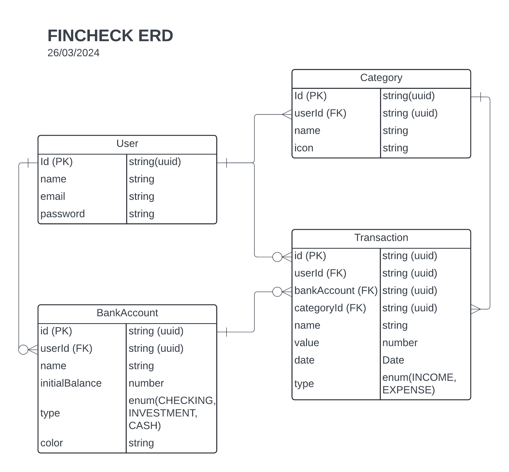

<p align="center">
  <a href="#" target="blank"></a>
</p>


## Description

API for a finance application built with NestJS, TypeScript and Prisma

## Installation

```bash
$ pnpm install
```

## Running the app

```bash
# development
$ pnpm run start

# watch mode
$ pnpm run start:dev

# production mode
$ pnpm run start:prod
```

## Test

```bash
# unit tests
$ pnpm run test

# e2e tests
$ pnpm run test:e2e

# test coverage
$ pnpm run test:cov
```

## ERD diagram

<p align="center">
  <a href="#" target="blank"></a>
</p>